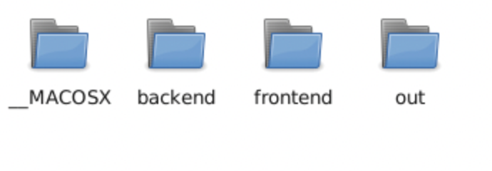
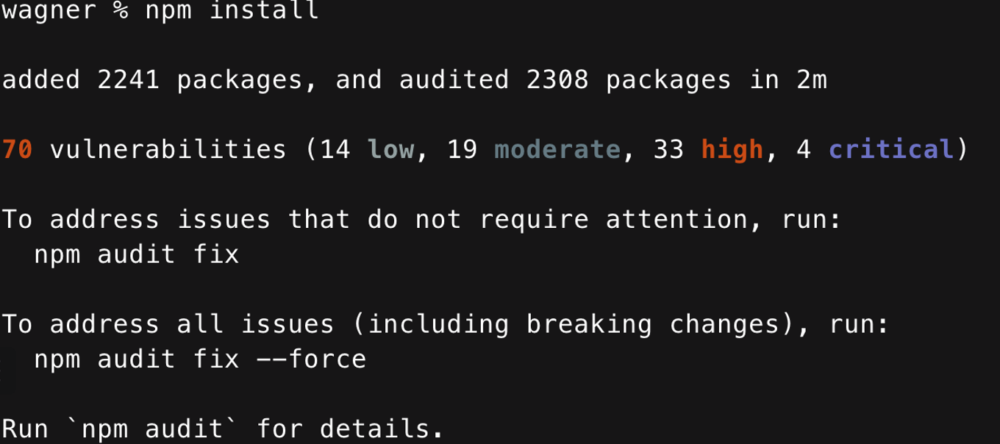
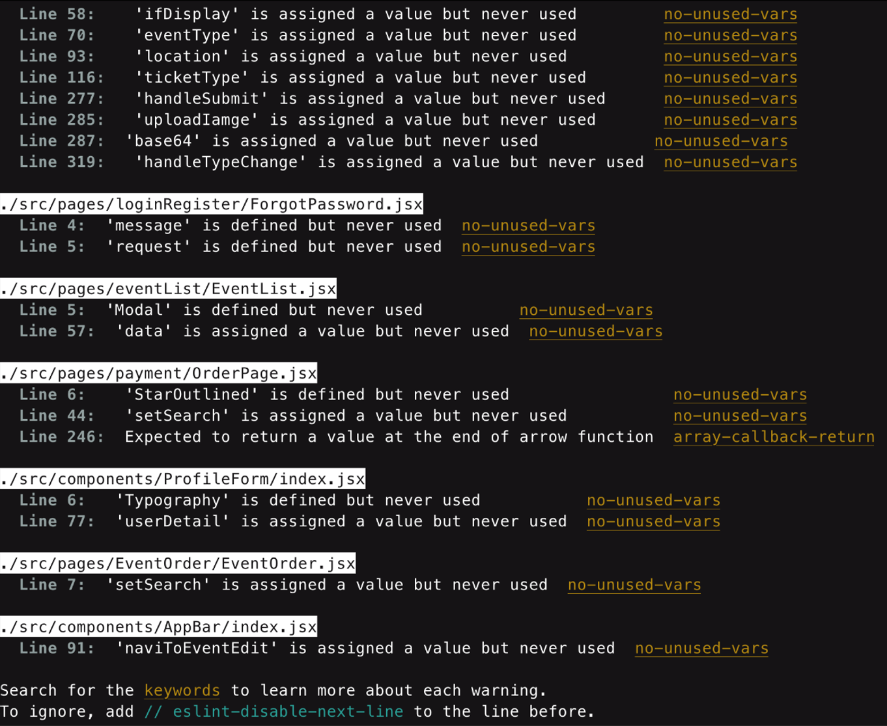
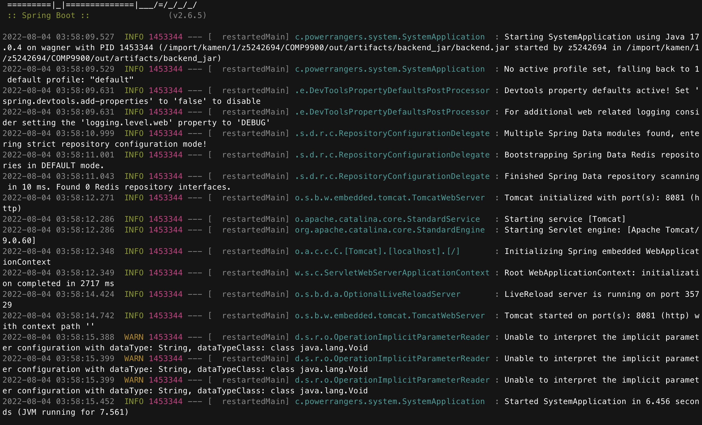

# capstone-project-9900-h16p-powerrangers

This is the capstone project of UNSW IT 22T2 COMP9900 Info Tech Project. This is a web application with separation of front-end and back-end, establishing an event management system for host and customer interaction likes creating event, managing event and booking tickets.

Powerrangers Team members list:

 - Yanfeng Chen (Scrum Master and Front-end developer)
 - Zexuan He (Front-end developer)
 - Haoyu Wang (Back-end developer)
 - Yu Jia (Back-end developer)
 - Zhaoyang Wang (Project manager)

## Below list should be installed on local environment.

1. Node.js

2. npm

3. yarn

4. JDK 11

## Front-end setup

### 1. Change to the root directory of project, which should show like below figure:

### 2. Move into the frontend directory with:

<b>cd frontend</b>

### 3. In the frontend directory, install the required dependencies with:

<b>npm install</b>

or

<b>yarn install</b>

It may take several minutes to complete and present information likes below figure:

Note that if there is any unexpected error occur, which makes you cannot install some dependencies successfully, then you can also download the pre-installed dependencies called “node_modules” referring to the link:
https://drive.google.com/file/d/1Igd-qxeP9UnCZpY44c-NrYKnFPp5CN8r/view?usp=sharing ,
and unzip and extract the content in the current directory, then you can move the next step.

### 4. In the current directory, run the frontend project with:

<b>npm start</b>

or

<b>yarn start</b>

Then you will see the information likes below figure if everything goes well.

### 5. Turn on a browser and visit our website via:

<b>http://localhost:3000/</b>

Now the front-end project is running on the port 3000.

## Back-end setup

### 1. Change to the root directory of project.

### 2. We have already packed the whole backend project into an executable file called “backend.jar”, which you can move into its directory with:

<b> cd out/artifacts/backend_jar</b>

### 3. To start to backend service via:

<b> java -jar backend.jar</b>

Then you should see information likes below figure:

Now the back-end service is running on the port 8081.

### 4. If everything goes well till now, the project has completely deployed and worked, enjoy! By the way, if you want to see the interfaces information of this project, you can open a browser and visit:

<b>http://localhost:8081/swagger-ui/index.html</b>

